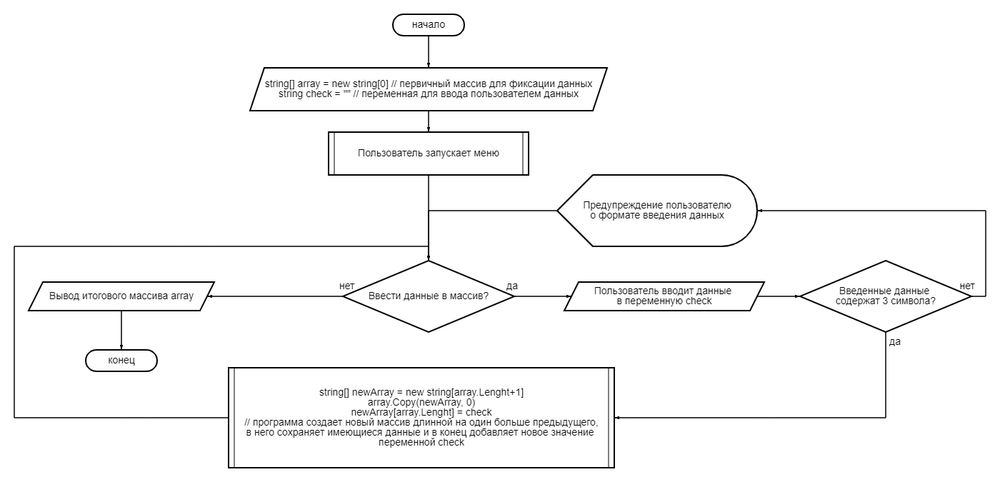

# Описание итоговой работы первой четверти GB!
Представляю Вашему вниманию проект программы по заполнению произвольного массива (списка) на основании введенных пользоватлем значений. 
## Техническое описание программы:
* В массив попадают записи больше 3 символов.
* Реализована меню выбора комманды внесения данных в массив и остановки заполнения массива.

**Блок-схема алгоритма программы:**
